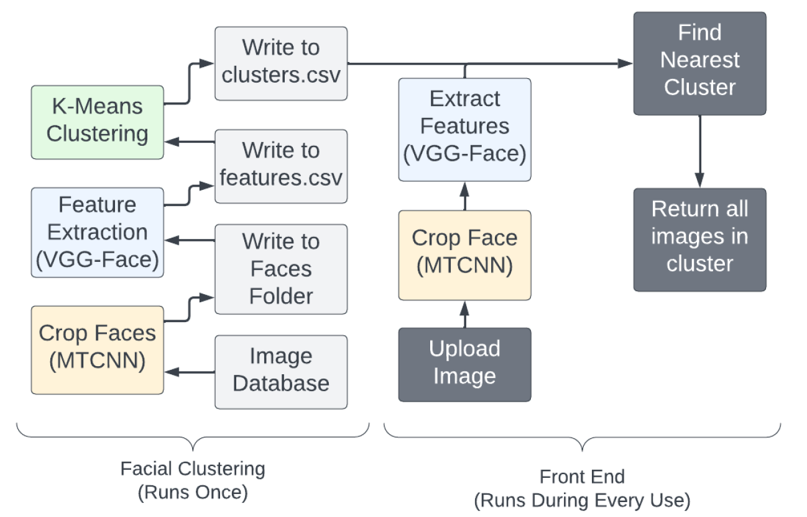
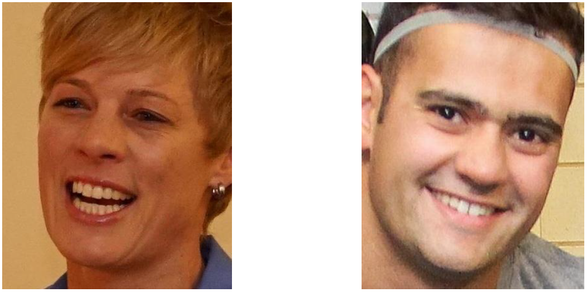
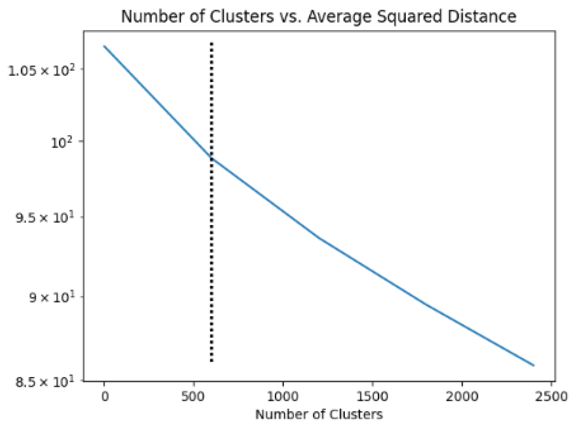

# Image Guyver

Image Guyver is an image clustering and retrieval system designed to efficiently find specific individuals in large, unlabeled image datasets. This project aims to solve the problem of scrolling through numerous unlabeled images by clustering similar faces and allowing quick retrieval based on a query image.
[Full Research Paper](https://drive.google.com/file/d/1jPOU6SU4mVW-ly92obYSVdtOuYMP_zlM/view?usp=sharing)

## Table of Contents
1. [QuickStart](#quickstart)
2. [Abstract](#abstract)
3. [Introduction](#introduction)
4. [System Architecture](#system-architecture)
5. [Key Features](#key-features)
6. [Methodology](#methodology)
7. [Results](#results)
8. [Discussion](#discussion)
9. [Future Work](#future-work)
10. [References](#references)

## QuickStart

Follow these steps to quickly set up and use Image Guyver for clustering and retrieving faces from your image dataset.

### 1. Clone the Repository

First, clone the Image Guyver repository to your local machine:

```bash
git clone https://github.com/yourusername/image-guyver.git
cd image-guyver
```

### 2. Install Dependencies

Ensure you have Python 3.7 or higher installed. Install the required Python packages using pip:

```bash
pip install numpy pandas scikit-learn tensorflow keras mtcnn
```

### 3. Configure File Paths

Update the file paths in both main.py and ui.py to match the locations of your image datasets and desired output directories.
In main.py:
```Python
# Folder Paths
raw_folder_path = 'path/to/your/raw_images'
face_folder_path = 'path/to/save/cropped_faces'
features_folder_path = 'path/to/save/features'
```

In ui.py:
```Python
dataset_features_filepath = "path/to/save/features"
raw = "path/to/your/raw_dataset"

img = "path/to/query_image"
output = "path/to/save/output"
```

Replace path/to/... with your actual directories.

### 4. Preprocess Images and Create Vector Database
Run main.py to preprocess all images in your database. This script will:
1. Detect and crop faces from the raw images.
2. Extract feature vectors for each cropped face.
3. Cluster the feature vectors to create a vector database.

Execute the script using:
```bash
python3 main.py
```

### 5. Retrieve Images Using a Query Image
To find and retrieve faces similar to an input query image, use ui.py. This script will:
1. Detect and crop faces from the input image.
2. Extract feature vectors for the cropped faces.
3. Search the vector database for the nearest clusters.
4. (Optional) Copy the top matching images to the specified output directory.

Run the script with
```bash
python3 ui.py
```

Ensure that the img variable in ui.py points to your query image and output is set to your desired output directory.

### 6. View the Results
After running ui.py, the results will be saved in the specified output directory. You can review the retrieved images to verify the clustering and retrieval performance.

## Abstract

Image Guyver is a system that performs feature extraction on faces in a large image dataset and clusters these faces into groups. Users can find images of a specific person by providing a query image, and the system returns the most relevant cluster. On average, this model achieved a sensitivity of 0.36, meaning it returned 36 out of every 100 images of the desired individual, significantly reducing the search space in large datasets.

## Introduction

The inspiration for this project came from the need to allow parents of students at the United States Air Force Academy (USAFA) to easily find images of their children in a large collection of event photos. The system addresses challenges such as high variability in the dataset, computational complexity, and working with unlabeled data.

## System Architecture



*Figure 1: Image Web Guyvre System Architecture*

The system architecture consists of several key components:
1. Face detection and cropping
2. Feature extraction using VGG-Face
3. K-means clustering
4. Cluster retrieval based on input image

## Key Features

- Efficient face detection and cropping
- Feature extraction using pre-trained VGG-Face model
- K-means clustering for organizing similar faces
- Quick retrieval of relevant images based on a query image
- Ability to handle large, unlabeled datasets

## Methodology

### Data Source
The project used a dataset of over 36,000 images from WebGuy, a company that takes pictures at USAFA cadet events. The images span from 2017 to 2023 and include a variety of settings and resolutions.

### Face Cropping
Face cropping was implemented using the MTCNN (Multi-Task Cascaded Convolutional Networks) face detection model. Bounding boxes were expanded by 10% to ensure the entire face was captured.



*Figure 2: Output images of cropping function*

### Feature Extraction
Feature extraction was performed using the pre-trained VGG-Face CNN, producing a 4096-dimensional feature vector for each face.

### K-Means Clustering
K-means clustering was applied to the extracted features, with the optimal number of clusters determined to be 600 through analysis of the elbow curve.



*Figure 3: Graph of Cluster Inertia by K*

## Results

The system achieved the following performance metrics:
- Inertia: 3.65*10^7
- Silhouette Score: 0.055
- Accuracy: 0.9916
- Sensitivity: 0.36

## Discussion

The system performs well in various environments, correctly classifying individuals across different settings. It shows robustness to facial coverings like masks but struggles with changes around the eye area, such as the addition or removal of glasses.

## Future Work

1. Start with labeled data for better performance metrics
2. Implement an ensemble of pre-trained CNNs for feature extraction
3. Explore hierarchical clustering as an alternative to k-means
4. Investigate direct similarity search without clustering
5. Train a custom feature extraction network
6. Develop a user-friendly interface integrated with the WebGuy website

## References

1. F. Schroff, D. Kalenichenko and J. Philbin, "FaceNet: A unified embedding for face recognition and clustering," 2015 IEEE Conference on Computer Vision and Pattern Recognition (CVPR)
2. Webguy FreeGallery Database, https://www.usafawebguy.com/FreeGallery?page=1
3. Omkar M. Parkhi, et al, "Deep Face Recognition," 2015. https://exposing.ai/vgg_face/
